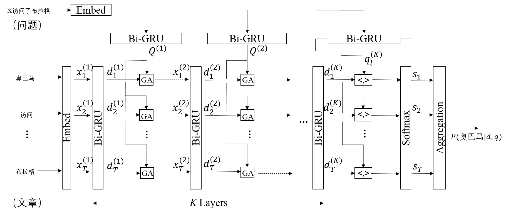

# Question_Answering_Models

This repo collects and re-produces models related to domains of question answering and machine reading comprehension.  

It's now still in the process of supplement.

## comunity QA

### Dataset

WikiQA, TrecQA, InsuranceQA

#### data preprocess on WikiQA

```
cd cQA
bash download.sh
python preprocess_wiki.py
```

### Siamese-NN model

This model is a simple complementation of a Siamese NN QA model with a pointwise way.

[To this repo for details](./cQA/siamese_nn)

#### train model

`python siamese.py --train`

#### test model

`python siamese.py --test`

### Siamese-CNN model

This model is a simple complementation of a Siamese CNN QA model with a pointwise way.

[To this repo for details](./cQA/siamese_cnn)

#### train model

`python siamese.py --train`

#### test model

`python siamese.py --test`

### Siamese-RNN model

This model is a simple complementation of a Siamese RNN/LSTM/GRU QA model with a pointwise way.

[To this repo for details](./cQA/siamese_rnn)

#### train model

`python siamese.py --train`

#### test model

`python siamese.py --test`

### note

All these three models above are based on the vanilla siamese structure. You can easily combine these basic deep learning module cells together and build your own models.

### QACNN

Given a question, a positive answer and a negative answer, this pairwise model can rank two answers with higher ranking in terms of the right answer.

[To this repo for details](./cQA/qacnn)


#### train model

`python qacnn.py --train`

#### test model

`python qacnn.py --test`

Refer to:

* [Applying Deep Learning to Answer Selection: A Study and an Open Task](http://arxiv.org/abs/1508.01585v2)

### Decomposable Attention Model

[To this repo for details](./cQA/decomposable_att_model)


#### train model

`python decomp_att.py --train`

#### test model

`python decomp_att.py --test`

Refer to:

* [A Decomposable Attention Model for Natural Language Inference](http://arxiv.org/abs/1606.01933v2)

### Compare-Aggregate Model with Multi-Compare

[To this repo for details](./cQA/seq_match_seq)


#### train model

`python seq_match_seq.py --train`

#### test model

`python seq_match_seq.py --test`

Refer to:

* [A Compare-Aggregate Model for Matching Text Sequences](http://arxiv.org/abs/1611.01747v1)

### BiMPM

[To this repo for details](./cQA/bimpm)


#### train model

`python bimpm.py --train`

#### test model

`python bimpm.py --test`

Refer to:

* [Bilateral Multi-Perspective Matching for Natural Language Sentences](http://arxiv.org/abs/1702.03814v3)

## Machine Reading Comprehension

### Dataset

CNN/Daily mail, CBT, SQuAD, MS MARCO, RACE

### GA Reader

To be done



Refer to:

* [Gated-Attention Readers for Text Comprehension](http://arxiv.org/abs/1606.01549v3)

### SA Reader

To be done


Refer to:

* [A Thorough Examination of the Cnn/Daily Mail Reading Comprehension Task](http://arxiv.org/abs/1606.02858v2)

### AoA Reader

To be done


Refer to:

* Attention-over-Attention Neural Networks for Reading Comprehension

### BiDAF

[To this repo for details](./MRC/BiDAF)


The result on dev set(single model) under my experimental environment is shown as follows:

| training step | batch size | hidden size  | EM (%) | F1 (%) |
| :--------: |:------:|:------:|:------:|:------:|
| 12W   | 32   | 75   | \ | \ |

Refer to:

* [Bidirectional Attention Flow for Machine Comprehension](https://arxiv.org/abs/1611.01603)

### RNet

[To this repo for details](./MRC/RNet)


The result on dev set(single model) under my experimental environment is shown as follows:

| training step | batch size | hidden size  | EM (%) | F1 (%) |
| :--------: |:------:|:------:|:------:|:------:|
| 12W   | 32   | 75   | \ | \ |

Refer to:

* [RNet](https://www.microsoft.com/en-us/research/publication/mrc/)
* [HKUST-KnowComp/R-Net](https://github.com/HKUST-KnowComp/R-Net)

### QANet

[To this repo for details](./MRC/QANet)


The result on dev set(single model) under my experimental environment is shown as follows:

| training step | batch size | hidden size  | EM (%) | F1 (%) |
| :--------: |:------:|:------:|:------:|:------:|
| 12W   | 32   | 96   | \ | \ |


Refer to:

* QANet: Combining Local Convolution with Global Self-Attention for Reading Comprehension
* github repo of [NLPLearn/QANet](https://github.com/NLPLearn/QANet)

## Information

For more information, please visit http://skyhigh233.com/blog/2018/04/26/cqa-intro/.
